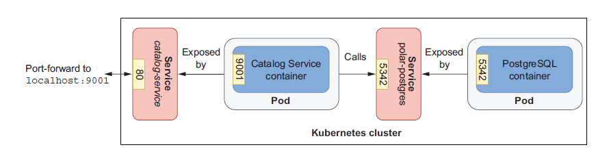

# Pre-request to start minikube and set profile context 

minikube start --cpus 2 --memory 4g --driver docker --profile polar

kubectl get nodes

kubectl config get-contexts

kubectl config current-context

kubectl config use-context polar

# 1 - Create Polar Postgres DB inside Kubernetes
cd E:\ws\ws-spring-cloud\cloud-native-spring-in-action-sb-3-main\Chapter07\07-end\polar-deployment\kubernetes\platform\development
$ kubectl apply -f services

# 2 - Load the catalog-service image inside Kubernetes
minikube image load catalog-service:0.0.1-SNAPSHOT --profile polar
minikube image list --profile polar

minikube image rm catalog-service:0.0.1-SNAPSHOT --profile polar

# 3 - Deploy catalog service
$ kubectl apply -f k8s/deployment.yml
$ kubectl logs deployment.apps/catalog-service

# 4 - Create Service (ClusterIP) for catalog service
$ cd E:\ws\ws-spring-cloud\cloud-native-spring-in-action-sb-3-main\Chapter07\07-end\catalog-service
$ kubectl apply -f  k8s/service.yml

$ kubectl get all -l app=catalog-service

# 5 - Export port on your local so that it can be accessed from kubernetes cluster

$ kubectl port-forward service/catalog-service 9001:80

# 6 - Port forward for postgres sql 
$ kubectl port-forward service/polar-postgres 5432:5432

# 7 Clean up polar-postgres and catalog-service

delete all the objects created for Catalog Service:

$ kubectl delete -f k8s

Navigate to the kubernetes/platform/development folder, and delete the PostgreSQL installation:

$ kubectl delete -f services

# 8 stop polar

$ minikube stop --profile polar

# 9 Validate kubernetes yaml
$ kubeconform --strict -d k8s 

# Other commands
kubectl delete  service/catalog-service
kubectl delete  deployment.app/catalog-service
minikube stop --profile polar
minikube start --profile polar
minikube delete --profile polar

# Query Pod details from Kubernetes
kubectl get pod
kubectl logs deployment/polar-postgres
kubectl logs deployment.apps/catalog-service
kubectl get all -l app=catalog-service
kubectl get svc -l app=catalog-service
kubectl api-resources
kubectl explain pods
minikube image list --profile polar

